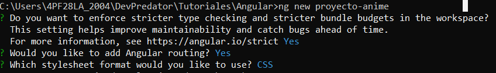
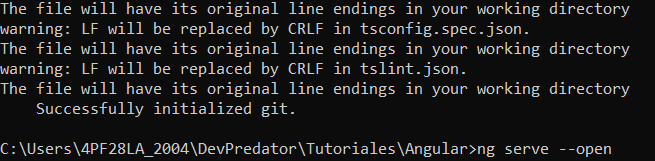
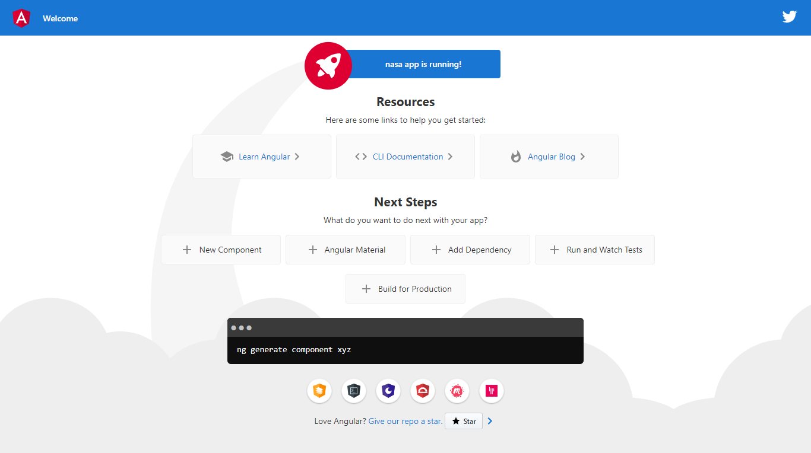

# ProyectoAnime

Este proyecto fué generado con [Angular CLI](https://github.com/angular/angular-cli) versión 11.0.6.

## Requerimientos

1.- Tener instalado NodeJS (https://nodejs.org/en/) Versión estable Recomendable
2.- Angular (https://angular.io/guide/setup-local)

Para verificar que tengas NodeJS instalado correctamente en una Terminal o CMD ejecuta el comando `nmp --version`, deberá de salirte la versión de node instalada.

## Crear proyecto desde cero

Paso 1: Crear proyecto angular.

Primero abre una Terminal o CMD y desde aquí, muevete al directorio que desees y ejecuta el comando `ng new proyecto-anime`. 

NOTA: EL PROCESO DE CREACIÓN DEL PROYECTO SUELE TARDAR POR LAS INSTALACIONES QUE REALIZA ANGULAR PARA CONFIGURAR TU PROYECTO. POR LO QUE ES MUY RECOMENDABLE QUE TENGAS UN INTERNET ESTABLE, SI PUEDES CONECTAR DIRECTAMENTE CON CABLE LAN PUEDE SER OTRA OPCIÓN :).

Paso 2: Opciones

Selecciona las opciones que se muestran en la siguiente imagen dependiendo del orden en las que se te vayan solicitando en la terminal.

Paso 3: Ejecutar el proyecto

Si todo sale bien, se te mostrará un mensaje que dice "Succesfully initialized git" y una nueva linea de terminal con el directorio actual. Ejecuta el comando `ng serve --open`

¡Listo!

Ya tendrás la siguiente salida de tu proyecto en la dirección `http://localhost:4200/`

